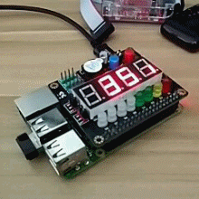

# SaksPi简介

树莓派结合[Saks](http://shumeipai.nxez.com/swiss-army-knife-shield-for-raspberry-pi)的一些代码片段

* 实现一个daemon来负责数码管移位显示
* 利用[BaiduPCS](https://github.com/GangZhuo/BaiduPCS)实现了百度网盘同步，平时拍的RAW格式照片只能在睡觉时上传，无赖。。。

最后show一张自己最爱的照片

